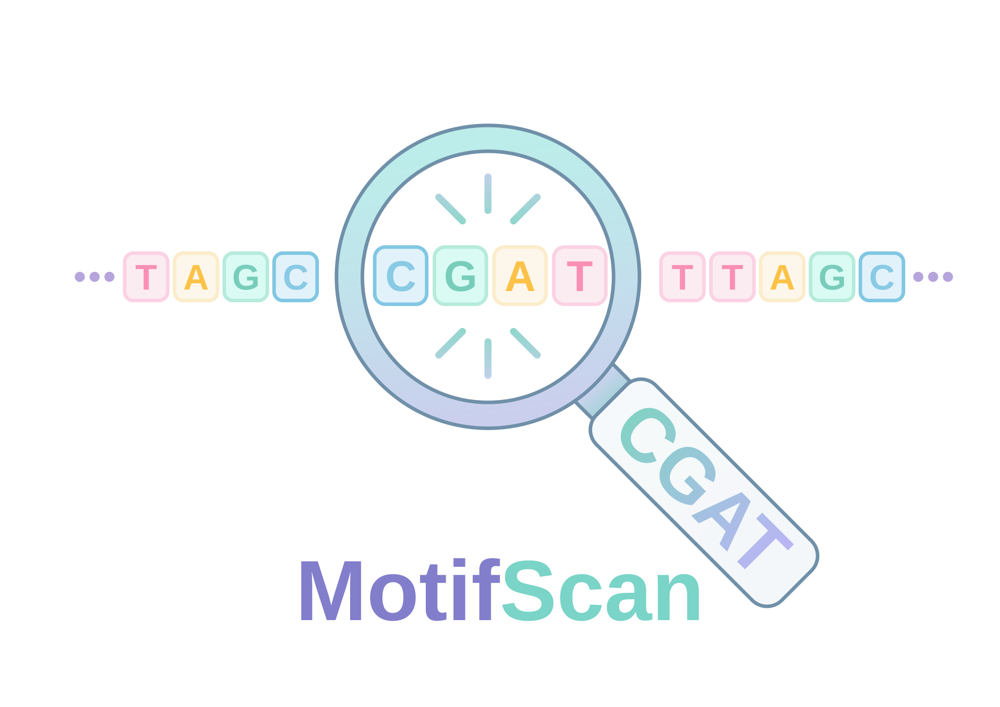

# MotifScan

[](https://www.rust-lang.org/)
[](https://crates.io/crates/motifscan)
[](https://crates.io/crates/motifscan)
[](https://docs.rs/motifscan)
[](https://github.com/jiehua1995/MotifScan/actions/workflows/ci.yml)
[](https://github.com/jiehua1995/MotifScan/releases)
[](LICENSE)
[](https://github.com/jiehua1995/MotifScan/stargazers)

<div style="display:flex;align-items:center;gap:18px;">
  <div style="flex:0 0 auto;">
    
  </div>
  <div style="flex:1 1 auto;">
    <h2 style="margin:0 0 6px 0; font-weight:700;">Streaming, low-memory motif scanning CLI in Rust</h2>
    <p style="margin:0;color:#444;">Fast exact motif counting plus a species-aware fuzzy mode for long reads that combines long-window approximate alignment with automatic diagnostic-SNP voting.</p>
  </div>
</div>

MotifScan is a streaming, low-memory, multi-threaded Rust CLI for FASTA and FASTQ reads. The original `count` command performs exact motif scanning. The new `species` command is designed for noisy long reads such as Oxford Nanopore cDNA/DNA, where long diagnostic windows should tolerate sequencing errors while species/allele assignment is based on informative SNPs.

## Dependency

- [Rust](https://rust-lang.org/tools/install/) toolchain for building from source

## Installation

### Build from source with the Rust toolchain:

```bash
git clone https://github.com/jiehua1995/MotifScan
cd MotifScan
cargo build --release
```

Binary path:

```bash
./target/release/motifscan
```

### Install directly from crates.io:

```bash
cargo install motifscan
```

Crates.io page: https://crates.io/crates/motifscan

## Version information

```bash
motifscan -v
motifscan --version
```

## Quick Start

### Exact motif counting

Multiple motifs:

```bash
motifscan count \
  -i reads.fastq \
  --motifs motifs.csv \
  --revcomp \
  -o count.csv
```

Single motif:

```bash
motifscan count \
  -i reads.fa \
  --motif ATTATGAGAATAGTGTG \
  --motif-name motif1 \
  -o count.csv
```

Read-level hits:

```bash
motifscan count \
  -i reads.fastq \
  --motifs motifs.csv \
  --report-read-hits read_hits.csv \
  -o count.csv
```

### Species-aware fuzzy long-read scanning

Provide the same two-column motif/reference CSV plus a three-column pair table describing which two references form one homologous locus:

```csv
locus,mel,sim
18S,18S_dmel,18S_dsim
28S,28S_dmel,28S_dsim
```

Then scan one or many long-read FASTQ files:

```bash
motifscan species \
  --input-list samples.txt \
  --motifs motifs.csv \
  --pairs pairs.csv \
  -o species_scan.csv \
  --pair-qc-output species_scan.pairs.csv \
  -t 48 \
  --progress
```

`species` mode:

- automatically aligns each paired reference and extracts diagnostic substitution SNPs;
- supports paired references of different lengths;
- uses shared exact k-mers only for fast candidate retrieval;
- verifies candidates with long-window semi-global edit alignment, allowing substitutions and indels;
- excludes diagnostic SNP positions from the locus-identity penalty;
- uses FASTQ Phred quality when voting mel/sim SNP alleles;
- scans forward and reverse-complement orientations;
- writes sample-by-locus summary, SNP-level QC, and optional pair/SNP extraction QC tables.

See [doc/species-mode.md](doc/species-mode.md) for the full algorithm, parameters, output definitions, interpretation, and validation strategy. An example dmel/dsim pair table is available at [doc/dmel_dsim_pairs.csv](doc/dmel_dsim_pairs.csv).

Logging: control logging via the `RUST_LOG` environment variable or the environment filter; no per-command `--debug` flag is available.

## motifscan Count Options

| Option | Default | Description | Notes |
|---|---:|---|---|
| `-i, --input` | required | Input reads file (FASTA/FASTQ or gz) | Use single `-i` followed by file |
| `-o, --output` | required | Output CSV path | Summary CSV; first column is motif |
| `-t, --threads` | auto | Number of worker threads | Must be at least 1 |
| `--progress` | false | Show progress bar on stderr | Useful for long runs |
| `--motif` | - | Single motif sequence | Mutually exclusive with `--motifs` |
| `--motifs` | - | Two-column CSV of motifs | `name,sequence` |
| `--motif-name` | `motif` | Name used with `--motif` | Only valid when `--motif` is provided |
| `--revcomp` | false | Also scan reverse complements | When set, reverse strand matches counted separately |

## motifscan Species Key Options

| Option | Default | Description |
|---|---:|---|
| `--input` | - | One FASTA/FASTQ(.gz) file |
| `--input-list` | - | TXT/TSV containing `path` or `sample<TAB>path` |
| `--motifs` | required | Two-column `name,sequence` reference CSV |
| `--pairs` | required | Three-column `locus,mel,sim` pair CSV |
| `-o, --output` | required | Sample-by-locus summary CSV |
| `-t, --threads` | auto | Rayon worker threads |
| `--progress` | false | Per-file byte/read progress |
| `--anchor-k` | 11 | Shared exact k-mer length used only for candidate retrieval |
| `--anchors-per-locus` | 8 | Number of shared anchors sampled per locus |
| `--alignment-slack` | 20 | Extra read bases around anchor-estimated alignment window |
| `--min-shared-identity` | 0.85 | Minimum identity at non-diagnostic positions |
| `--min-aligned-bases` | 80 | Minimum aligned reference bases |
| `--min-snp-baseq` | 15 | Minimum diagnostic-SNP Phred score |
| `--min-informative-snps` | 2 | Minimum high-quality SNPs needed for mel/sim call |
| `--species-fraction` | 0.75 | Required fraction supporting one species |
| `--locus-mode` | `best` | Keep one best locus/read or all passing loci |

## Motif CSV Format

```text
name,sequence
motif1,ATTATGAGAATAGTGTG
motif2,TTCATTCATGGTGGCAGTAAAATGTTTATTGTG
motif3,ATGAA
```

## Exact-count Output CSV Columns

Summary:

```text
motif,sequence,length,reads_with_hit,total_hits,forward_hits,revcomp_hits
```

Read hits:

```text
read_id,motif,strand,position,matched_sequence
```

## Notes

- Input sequences are normalized to uppercase before matching.
- Exact `count` mode counts overlapping hits.
- Palindromic motifs are not double-counted in exact reverse-complement mode.
- If a motif is longer than a read, that read is skipped for that motif in exact mode.
- FASTQ input is parsed as standard four-line records and Phred+33 quality is decoded once by the input layer.
- `species` mode intentionally does not use paired-reference indels as species votes by default; they are retained as QC because long-read indel errors are harder to model reliably than substitutions.

## Citation

Just mention this repository or cite like:

```bibtex
@software{motifscan,
  author = {jiehua1995},
  title = {MotifScan},
  url = {https://github.com/jiehua1995/MotifScan},
  version = {0.1.8}
}
```

## Releases

If you do not want to build from source, you can download a prebuilt artifact from GitHub Releases generated by CI. Local builds are still recommended because they are the best way to ensure the binary matches your environment.
